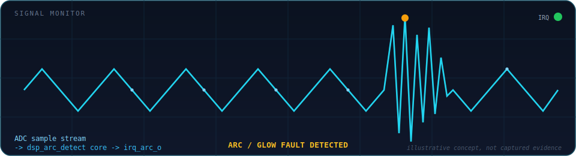
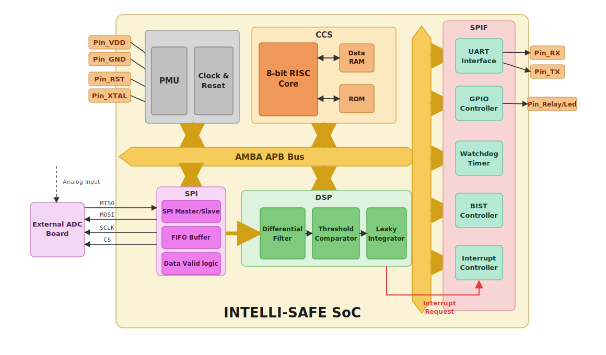
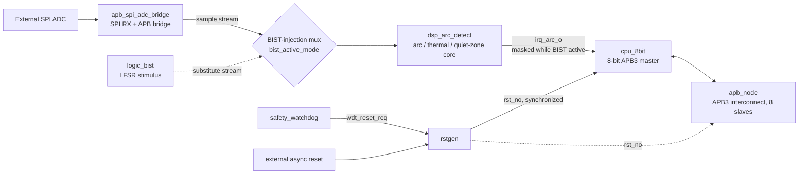

<p align="center">
  
</p>

<p align="center">
  
</p>

<p align="center">
  
  
  
  
  
</p>

<p align="center"><i>Detects electrical arcing and glowing-contact faults in hardware, at the register-transfer level.</i></p>

<br/>

<p align="center">
  
</p>
<p align="center"><sub>Illustrative signal concept — not captured simulation evidence. Capture a real waveform via <code>run/scripts/run_full_gui.bat</code> and Questa's wave viewer.</sub></p>

<br/>

## Table of Contents

- [What Is This](#what-is-this)
- [Architecture](#architecture)
- [Reusable IP Blocks](#reusable-ip-blocks)
- [Repository Layout](#repository-layout)
- [Quick Start](#quick-start)
- [Quartus / Synthesis](#quartus--synthesis)
- [Scope & Roadmap](#scope--roadmap)
- [Documentation Map](#documentation-map)

---

## What Is This

`In_SOC` is a **verified mini-SoC FPGA prototype** for electrical arc and glowing-contact detection, targeting Intel/Altera **Cyclone V**. It integrates:

- an 8-bit control CPU (`cpu_8bit`) as the single APB3 master
- an APB3 interconnect (`apb_node`) fanning out to 8 slaves
- an SPI ADC acquisition frontend (`apb_spi_adc_bridge`)
- a DSP-based arc/thermal detection core (`dsp_arc_detect`) — the project's primary IP candidate
- a basic APB watchdog (`safety_watchdog`) and a functional BIST helper (`logic_bist`)
- GPIO, UART, and an advanced Timer peripheral

> The current project is a verified mini-SoC FPGA prototype. The DSP, SPI bridge, Watchdog, and BIST blocks are documented as reusable-IP candidates, with `dsp_arc_detect` selected as the primary IP to package first. The design is **not yet** a complete commercial IP catalog; remaining work includes standalone packaging, stronger verification, timing/resource evidence, and strict alignment between report claims and implemented RTL.
>
> — [`docs/ip/ip_scope_and_rtl_alignment.md`](docs/ip/ip_scope_and_rtl_alignment.md)

## Architecture

<p align="center">
  
</p>
<p align="center"><sub>Top-level block diagram — Infrastructure (PMU/Clock/Reset), CCS (CPU + RAM/ROM), SPI acquisition, DSP arc-detection pipeline, and SPIF peripheral cluster (UART, GPIO, Watchdog, BIST, Interrupt Controller), all hung off the AMBA APB bus.</sub></p>

Simplified signal-flow view, mapped to the actual RTL module/signal names:



**APB3 memory map** (`rtl/include/config.sv`, decoded by `apb_node`):

| Index | Slave | Base Address |
| :-: | --- | --- |
| 0 | RAM (internal) | `0x0000_0000` |
| 1 | `dsp_arc_detect` | `0x0000_1000` |
| 2 | `apb_gpio` | `0x0000_2000` |
| 3 | `apb_uart_wrap` | `0x0000_3000` |
| 4 | `apb_adv_timer` | `0x0000_4000` |
| 5 | `safety_watchdog` | `0x0000_5000` |
| 6 | `logic_bist` | `0x0000_6000` |
| 7 | `apb_spi_adc_bridge` | `0x0000_7000` |

`top_soc` (`rtl/top_soc.sv`) is the reference/demo integration only — it is **not** the reusable-IP packaging boundary. See [Reusable IP Blocks](#reusable-ip-blocks).

## Reusable IP Blocks

Each block below exists both as the integrated copy under `rtl/periph/` (used by `top_soc`) and as a standalone package under `ip/<block>/` with its own `rtl/`, `tb/`, `docs/`, and `scripts/` — the two copies are kept functionally equivalent by hand, with no automated sync.

| Block | Role | Classification | Docs |
| --- | --- | --- | --- |
| **`dsp_arc_detect`** | Arc / thermal / quiet-zone detection core, telemetry, APB wrapper as public entry point | **Primary IP candidate** | [`docs/ip/dsp_arc_detect.md`](docs/ip/dsp_arc_detect.md) · [`ip/dsp_arc_detect/README.md`](ip/dsp_arc_detect/README.md) |
| `apb_spi_adc_bridge` | SPI ADC acquisition bridge with APB control/status + live sample stream | Secondary IP candidate | [`docs/ip/apb_spi_adc_bridge.md`](docs/ip/apb_spi_adc_bridge.md) |
| `safety_watchdog` | Basic APB-configurable watchdog | Secondary / basic IP candidate | [`docs/ip/safety_watchdog.md`](docs/ip/safety_watchdog.md) |
| `logic_bist` | Functional BIST helper (LFSR/MISR stimulus path) | Secondary / diagnostic IP candidate | [`docs/ip/logic_bist.md`](docs/ip/logic_bist.md) |
| `top_soc` | Full-system integration and regression target | Reference design (not an IP boundary) | [`rtl/top_soc.sv`](rtl/top_soc.sv) |

`cpu_8bit`, `apb_node`, `apb_gpio`, `apb_uart_wrap`, and `apb_adv_timer` are project-specific support blocks, not packaged as standalone IP today.

## Repository Layout

```text
In_SOC/
├── rtl/                    # Synthesizable SystemVerilog: top_soc, core, bus, periph, lib
├── ip/                     # Standalone reusable-IP packages (rtl + tb + docs + scripts each)
├── sim/                    # Full-SoC and block-level testbenches (tb_professional, tb_dsp_upgrades, ...)
├── run/                    # Regression entry points and .do files — see run/README.md
├── firmware/               # External CPU program image ($readmemh) + format docs
├── docs/                   # IP specs, scope/alignment rules, architecture guides
├── plan/                   # Future-work plans — not yet implemented in RTL
├── script/                 # Standalone VCD flow-visualizer (unrelated to Questa regressions)
├── In_SOC.qpf / .qsf / .sdc  # Quartus Prime project (Cyclone V)
└── README.md
```

## Quick Start

Requires Siemens Questa/ModelSim (`vsim` on `PATH`) with Intel/Altera simulation libraries. Run from the repository root; see [`run/README.md`](run/README.md) for the authoritative, up-to-date invocation reference.

```bat
cd /d D:\APP\Quatus_Workspace\In_SOC

:: Full SoC regression (tb_professional)
run\scripts\run_modelsim_here.bat full --no-pause

:: DSP-focused regression (tb_dsp_upgrades)
run\scripts\run_modelsim_here.bat dsp --no-pause

:: Standalone dsp_arc_detect IP regression
run\scripts\run_modelsim_here.bat ip_dsp --no-pause

:: list all targets
run\scripts\run_modelsim_here.bat list
```

| Target | Testbench | Expected summary |
| --- | --- | --- |
| `full` | `tb_professional` | `EXTRA SCENARIOS 11-26 SUMMARY: PASS=16 FAIL=0 KNOWN_ISSUE=0` |
| `dsp` | `tb_dsp_upgrades` | `[DSP-UPG] SUMMARY PASS=9 FAIL=0` |
| `ip_dsp` | `ip/dsp_arc_detect` standalone | `[DSP-IP] SUMMARY PASS=4 FAIL=0` |
| `support` | `tb_support_blocks` | `[SUPPORT] SUMMARY PASS=3 FAIL=0` |
| `periph` | `tb_apb_peripherals` | `[PERIPH] SUMMARY PASS=3 FAIL=0` |

Regression pass/fail is transcript-grep based (see `run/scripts/run_modelsim_here.bat`), not a scoreboard exit code — always confirm the printed **SUMMARY** line.

Waveform GUI:

```bat
run\scripts\run_modelsim_gui_here.bat        :: full SoC bench
run\scripts\run_modelsim_gui_here.bat dsp    :: DSP-focused bench
```

Each IP package is also independently regressable, e.g. `run\scripts\ip_dsp\run_regression.bat --no-pause`.

## Quartus / Synthesis

- Open [`In_SOC.qpf`](In_SOC.qpf) in Quartus Prime (Cyclone V device support required)
- Main project file: [`In_SOC.qsf`](In_SOC.qsf)
- Top-level RTL: [`rtl/top_soc.sv`](rtl/top_soc.sv)

## Scope & Roadmap

This is a **verified mini-SoC prototype with reusable-IP candidates** — not a finished commercial IP catalog. Wording precision matters here; see [`docs/ip/ip_scope_and_rtl_alignment.md`](docs/ip/ip_scope_and_rtl_alignment.md) before quoting capabilities elsewhere:

- Watchdog is a **basic APB watchdog** today, not an independent/windowed safety watchdog.
- BIST is **functional BIST** (LFSR/MISR stimulus), not production scan LBIST.
- The SPI bridge is fire-and-forget streaming with APB telemetry, not a FIFO/backpressure fabric.
- `top_soc` is a reference integration, never the reusable-IP packaging boundary.

Items under [`plan/`](plan/) (`dsp_plan.md`, `watchdog_plan.md`, `bist_plan.md`, `cdc_async_fifo_plan.md`) describe **future work** and must not be read as already implemented unless cross-checked against current RTL.

## Documentation Map

| Topic | Location |
| --- | --- |
| IP scope & safe-wording rules | [`docs/ip/ip_scope_and_rtl_alignment.md`](docs/ip/ip_scope_and_rtl_alignment.md) |
| Per-block IP index | [`docs/ip/README.md`](docs/ip/README.md) |
| `dsp_arc_detect` standalone package | [`ip/dsp_arc_detect/README.md`](ip/dsp_arc_detect/README.md) · [`ip/dsp_arc_detect/docs/verification.md`](ip/dsp_arc_detect/docs/verification.md) |
| Regression scripts & invocation | [`run/README.md`](run/README.md) |
| Firmware image format & memory map | [`firmware/README.md`](firmware/README.md) |
| Future-work plans | [`plan/`](plan/) |
| Flow visualizer tool (unrelated to Questa) | [`docs/script_readme.md`](docs/script_readme.md) |
| Contributor/agent guidance | [`CLAUDE.md`](CLAUDE.md) |

---

<p align="center">
  
</p>
