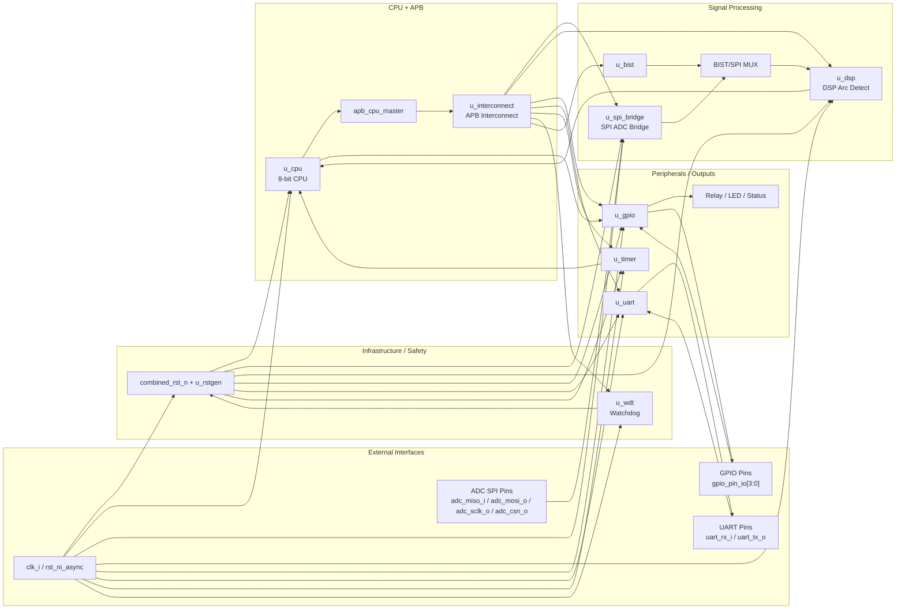

# In\_SOC System Architecture Draw.io Guide

Tai lieu nay dung de ve **so do kien truc he thong** cho `top_soc` trong draw.io theo dung RTL hien tai, nhung van de doc va de trinh bay.

Muc tieu:
- phan biet ro `top-level architecture` va `testbench`
- chi giu cac block kien truc quan trong
- the hien duoc duong du lieu chinh, duong APB, clock/reset, va cac tin hieu an toan

---

## 1. Nguyen tac ve

Khong nen ve:
- `force`, `assign`, `always`, `initial`
- cac net debug/testbench
- chi tiet APB level qua sau cho tung bit

Nen ve:
- block module cap he thong
- bus APB nhu 1 backbone
- luong du lieu `SPI -> DSP -> CPU/GPIO`
- luong an toan `WDT -> reset`, `BIST -> mux DSP`, `Timer -> CPU`

---

## 2. So do nen ve

Ve 1 so do chinh duy nhat cho `top_soc`, bo cuc trai sang phai:

1. `External Interfaces`
2. `Infrastructure`
3. `CPU + APB Interconnect`
4. `Signal Processing`
5. `Peripherals / Safety Outputs`

### 2.1 Bo cuc de xuat

- Cot 1 ben trai:
  - `Clock / Reset`
  - `SPI ADC Pins`
  - `UART Pins`
  - `GPIO Pins`
- Cot 2:
  - `Reset / Safety Infrastructure`
  - `Watchdog`
- Cot 3:
  - `CPU`
  - `APB Master`
  - `APB Interconnect`
- Cot 4:
  - `SPI ADC Bridge`
  - `BIST`
  - `DSP Arc Detect`
- Cot 5 ben phai:
  - `GPIO`
  - `UART`
  - `Timer`
  - `Relay / LED / Status`

---

## 3. Danh sach block nen dat trong draw.io

### 3.1 External Interfaces

- `clk_i`
- `rst_ni_async`
- `adc_miso_i`
- `adc_mosi_o`
- `adc_sclk_o`
- `adc_csn_o`
- `uart_rx_i`
- `uart_tx_o`
- `gpio_pin_io[3:0]`

### 3.2 Infrastructure

- `combined_rst_n`
- `u_rstgen`
- `u_wdt`

### 3.3 Compute + Bus

- `u_cpu`
- `apb_cpu_master`
- `u_interconnect`

### 3.4 Signal Processing

- `u_spi_bridge`
- `u_bist`
- `u_dsp`
- `BIST/SPI MUX`

### 3.5 Peripheral + Outputs

- `u_gpio`
- `u_uart`
- `u_timer`
- `Relay / Indicators`

---

## 4. Ket noi chinh can ve

### 4.1 Clock / Reset

- `clk_i -> u_rstgen`
- `clk_i -> u_cpu`
- `clk_i -> u_spi_bridge`
- `clk_i -> u_dsp`
- `clk_i -> u_gpio`
- `clk_i -> u_uart`
- `clk_i -> u_timer`
- `clk_i -> u_wdt`
- `combined_rst_n -> u_rstgen`
- `rst_no -> u_cpu`
- `rst_no -> u_spi_bridge`
- `rst_no -> u_dsp`
- `rst_no -> u_gpio`
- `rst_no -> u_uart`
- `rst_no -> u_timer`
- `rst_no -> u_wdt`
- `u_wdt.wdt_reset_o -> combined_rst_n path`

### 4.2 SPI / ADC path

- `adc_miso_i -> u_spi_bridge`
- `u_spi_bridge -> adc_mosi_o`
- `u_spi_bridge -> adc_sclk_o`
- `u_spi_bridge -> adc_csn_o`
- `u_spi_bridge.sample_data_o -> BIST/SPI MUX`
- `u_spi_bridge.sample_valid_o -> BIST/SPI MUX`
- `u_spi_bridge.overrun_o -> u_dsp.sample_overrun_i`
- `u_spi_bridge.stream_restart_o -> u_dsp.stream_restart_i`

### 4.3 BIST / DSP path

- `u_bist.bist_data_o -> BIST/SPI MUX`
- `u_bist.bist_valid_o -> BIST/SPI MUX`
- `u_bist.bist_active_o -> BIST/SPI MUX select`
- `BIST/SPI MUX -> u_dsp.adc_data_i`
- `BIST/SPI MUX -> u_dsp.adc_valid_i`
- `u_dsp.irq_arc_o -> irq_arc_critical`
- `irq_arc_critical -> u_cpu.irq_arc_i`
- `bist_active_mode -> irq mask logic`

### 4.4 CPU / APB path

- `u_cpu.apb_mst -> apb_cpu_master`
- `apb_cpu_master -> u_interconnect`
- `u_interconnect -> DSP slave`
- `u_interconnect -> GPIO slave`
- `u_interconnect -> UART slave`
- `u_interconnect -> TIMER slave`
- `u_interconnect -> WDT slave`
- `u_interconnect -> BIST slave`
- `u_interconnect -> SPI bridge slave`
- `u_interconnect -> RAM slave`

### 4.5 Safety / Output path

- `u_dsp irq / CPU ISR -> u_gpio`
- `u_gpio.gpio_out[0] -> relay control`
- `u_gpio <-> gpio_pin_io[3:0]`
- `u_uart.sout_o -> uart_tx_o`
- `uart_rx_i -> u_uart.sin_i`
- `u_timer.events_o[3] -> irq_timer_tick -> u_cpu.irq_timer_i`

---

## 5. APB backbone nen ve the nao

Khuyen nghi:
- khong ve 8 day APB rieng cho tung slave
- ve 1 **bus APB dam** o giua so do
- dat `u_interconnect` o trung tam
- moi slave noi ra APB bang 1 nhanh ngan co nhan:
  - `DSP APB`
  - `GPIO APB`
  - `UART APB`
  - `TIMER APB`
  - `WDT APB`
  - `BIST APB`
  - `SPI APB`
  - `RAM APB`

Neu ban muon de doc hon nua, tren backbone chi can ghi:

`PADDR / PWDATA / PWRITE / PSEL / PENABLE / PRDATA / PREADY / PSLVERR`

---

## 6. Block labels nen dat trong draw.io

### 6.1 CPU

`u_cpu`

Mo ta nho:
- 8-bit control CPU
- APB master
- interrupt input: arc, timer

### 6.2 SPI Bridge

`u_spi_bridge`

Mo ta nho:
- SPI ADC frontend
- APB configurable
- sample stream output
- overrun / restart telemetry

### 6.3 DSP

`u_dsp`

Mo ta nho:
- arc detection core
- adaptive threshold
- spike window
- thermal path
- quiet-zone path
- telemetry

### 6.4 BIST

`u_bist`

Mo ta nho:
- self-test pattern injection
- DSP stimulus override

### 6.5 Watchdog

`u_wdt`

Mo ta nho:
- APB watchdog
- reset request

### 6.6 Timer

`u_timer`

Mo ta nho:
- periodic event / irq source

### 6.7 GPIO

`u_gpio`

Mo ta nho:
- relay control
- status pins

### 6.8 UART

`u_uart`

Mo ta nho:
- communication / report

---

## 7. Style de ve dep trong draw.io

### 7.1 Mau

- External I/O: xanh nhat
- Infrastructure/Safety: vang kem
- CPU/APB: tim nhat
- Signal Processing: cam nhat
- Peripherals: xanh la nhat

### 7.2 Kieu day

- Clock/reset: mau xam hoac xanh dam
- APB backbone: den dam hoac nau dam
- ADC/SPI signal path: xanh duong
- DSP/BIST path: cam
- Safety trip / IRQ: do hoac tim dam

### 7.3 Kieu hinh

- Moi block: rounded rectangle
- MUX: hinh thoi nho
- External pins: hinh chu nhat nho o ria
- APB backbone: mot thanh ngang/dung dam

---

## 8. Ban ve chi tiet khuyen nghi

### 8.1 Hinh 1 cho bao cao tong quan

Chi giu:
- External I/O
- Reset / WDT
- CPU
- APB Interconnect
- SPI Bridge
- BIST
- DSP
- GPIO
- UART
- Timer
- Relay / Status

### 8.2 Hinh 2 cho chuong DSP

Ve rieng `u_dsp`:
- Stage A
- Stage B
- thermal path
- quiet-zone path
- telemetry registers

### 8.3 Hinh 3 cho verification

Neu can, ve rieng:
- `tb_professional`
- `stimulus`
- `fault injection`
- `scoreboard`
- `top_soc`

Khong nen tron vao Hinh 1.

---

## 9. Mermaid phac thao nhanh

Ban co the dung doan nay de nhin bo cuc truoc khi ve draw.io:

---

## 10. Version rat de ve nhanh trong draw.io

Neu ban can mot ban sieu gon de ve trong 10-15 phut, chi can ve:

- `External I/O`
- `Reset + Watchdog`
- `CPU`
- `APB Interconnect`
- `SPI Bridge`
- `BIST`
- `DSP`
- `GPIO`
- `UART`
- `Timer`

Va cac mui ten:

- `ADC -> SPI Bridge -> MUX -> DSP`
- `DSP -> CPU`
- `Timer -> CPU`
- `CPU -> APB`
- `APB -> GPIO/UART/Timer/WDT/BIST/SPI/DSP`
- `CPU -> GPIO -> Relay`
- `WDT -> Reset`

---

## 11. Ket luan

So do bao cao tot nhat cho project nay khong phai la netlist simulation chi tiet, ma la:

- **1 so do kien truc he thong cap block**
- **1 so do datapath DSP rieng**
- **1 so do verification neu can**

Voi `top_soc`, hinh o muc block-level ben tren la phuong an toi uu de ve trong draw.io.
