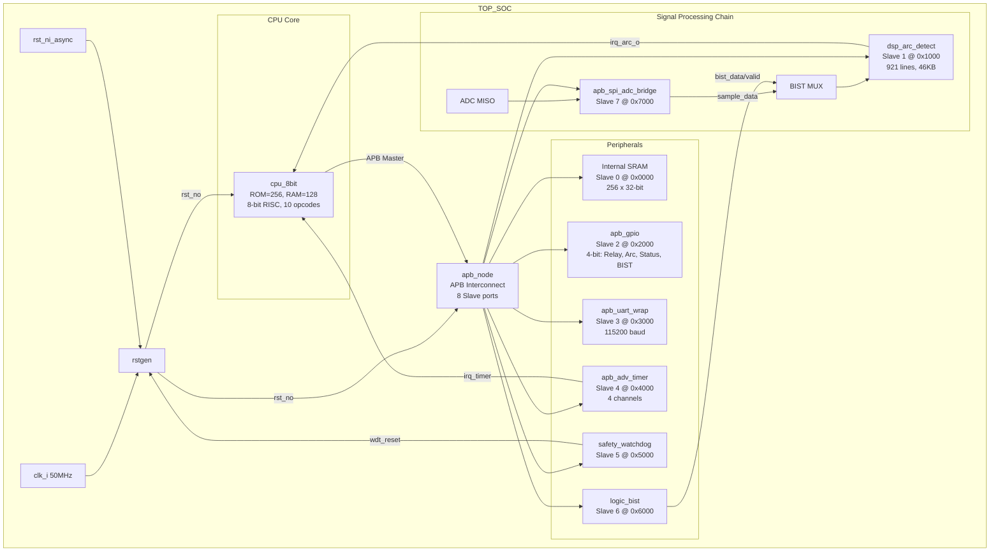
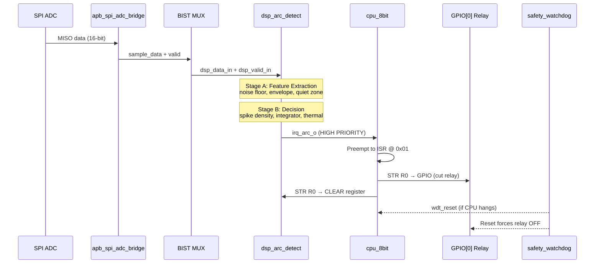

# 🔬 In_SOC — Báo Cáo Rà Soát Toàn Bộ Dự Án

## Tổng quan nhanh

| Thuộc tính | Giá trị |
|---|---|
| **Tên dự án** | In_SOC |
| **Mục đích** | Mini SoC FPGA phát hiện hồ quang điện (arc fault) & glowing-contact |
| **FPGA mục tiêu** | Intel Cyclone V (5CSEMA5F31C6) — DE1-SoC |
| **EDA Tool** | Quartus Prime 25.1 Lite + Questa/ModelSim |
| **Ngôn ngữ** | SystemVerilog 2005 |
| **Tổng file RTL** | 44 file (.sv / .svh) |
| **Tổng tài liệu** | 18 file (.md) |
| **Clock hệ thống** | 50 MHz |
| **Bus** | AMBA APB v3.0 |
| **IO Standard** | 3.3V LVTTL |

---

## 1. Kiến trúc hệ thống



---

## 2. Memory Map (APB Address Space)

| Slave # | Block | Base Address | End Address | Loại |
|---|---|---|---|---|
| 0 | Internal SRAM | `0x0000_0000` | `0x0000_0FFF` | RW Memory |
| 1 | DSP Arc Detect | `0x0000_1000` | `0x0000_1FFF` | MMIO Registers |
| 2 | GPIO | `0x0000_2000` | `0x0000_2FFF` | MMIO Registers |
| 3 | UART | `0x0000_3000` | `0x0000_3FFF` | MMIO Registers |
| 4 | Timer | `0x0000_4000` | `0x0000_4FFF` | MMIO Registers |
| 5 | Watchdog | `0x0000_5000` | `0x0000_5FFF` | MMIO Registers |
| 6 | Logic BIST | `0x0000_6000` | `0x0000_6FFF` | MMIO Registers |
| 7 | SPI ADC Bridge | `0x0000_7000` | `0x0000_7FFF` | MMIO Registers |

> [!NOTE]
> CPU 8-bit dùng Immediate 8-bit (0x00–0xFF). 4-bit cao chọn thiết bị (Chip Select), 4-bit thấp chọn offset trong thiết bị. DSP có thêm `dsp_page_sel` để mở rộng vùng address.

---

## 3. Chi tiết từng IP Block

### 3.1 `cpu_8bit` — Bộ xử lý điều khiển
- **File**: [cpu_8bit.sv](file:///d:/APP/Quatus_Workspace/In_SOC/rtl/core/cpu_8bit.sv) (335 dòng, 13KB)
- **Kiến trúc**: 8-bit RISC, 8 thanh ghi (R0–R7), ROM 256 words, RAM 128 words
- **ISA**: 10 opcode (NOP, LDI, ADD, SUB, AND, JMP, BEQ, STR, LDR, RET)
- **Pipeline**: 3 trạng thái (FETCH → DECODE → APB_ACCESS) + FAULT_RECOVERY
- **Interrupt**: 2 mức ưu tiên
  - `irq_arc_i` (cao) → vector 0x01, preempt được timer ISR
  - `irq_timer_i` (thấp) → vector 0x09
- **Firmware**: nạp từ file hex bằng `$readmemh("firmware/cpu_program.hex")`
- **Đặc biệt**: Có `dsp_page_sel` để truy cập DSP register space rộng hơn

### 3.2 `dsp_arc_detect` — Lõi phát hiện hồ quang
- **File**: [dsp_arc_detect.sv](file:///d:/APP/Quatus_Workspace/In_SOC/rtl/periph/dsp_arc_detect.sv) (921 dòng, **46KB** — module lớn nhất)
- **Chức năng**: Xử lý tín hiệu số realtime phát hiện arc fault
- **Pipeline 2 stage**:
  - **Stage A**: Front-end feature extraction (noise floor, envelope LP, quiet zone)
  - **Stage B**: Decision/scoring (spike density, integrator, thermal, quiet-zone)
- **5 loại phát hiện lỗi** (cause codes):
  1. `ARC_DENSITY` — Mật độ spike vượt ngưỡng
  2. `ARC_STANDARD` — Integrator bão hòa
  3. `THERMAL` — Hotspot score chạm limit
  4. `QUIET_ZONE` — Phát hiện vùng im lặng bất thường
  5. `NONE` — Không có lỗi
- **42 thanh ghi APB** (0x00–0xA4), bao gồm:
  - Cấu hình ngưỡng, attack, decay, window
  - Telemetry realtime (diff, integrator, spike_sum, noise_floor...)
  - 4 profile cấu hình có sẵn (SAFE_RESET, ARC_BALANCED, THERMAL_BAL, LAB_FULL)
- **Adaptive noise floor**: IIR filter, gain-shift tự chỉnh threshold

### 3.3 `apb_spi_adc_bridge` — Cầu SPI ↔ ADC
- **File**: [apb_spi_adc_bridge.sv](file:///d:/APP/Quatus_Workspace/In_SOC/rtl/periph/spi_master/apb_spi_adc_bridge.sv) (9KB)
- **Chức năng**: SPI master giao tiếp ADC bên ngoài, chuyển mẫu 16-bit sang DSP
- **Cấu hình**: CPOL=0, CPHA=0, MSB first, SCLK_DIV=2
- **Output**: `sample_data_o[15:0]`, `sample_valid_o`, `busy_o`, `overrun_o`

### 3.4 `safety_watchdog` — Watchdog an toàn
- **File**: [safety_watchdog.sv](file:///d:/APP/Quatus_Workspace/In_SOC/rtl/periph/safety_watchdog.sv) (6KB)
- **Chức năng**: Reset hệ thống nếu CPU không kick đúng hạn
- **Output**: `wdt_reset_o` → giữ reset 16 cycle trước khi thả

### 3.5 `logic_bist` — Self-Test Logic
- **File**: [logic_bist.sv](file:///d:/APP/Quatus_Workspace/In_SOC/rtl/periph/logic_bist.sv) (8KB)
- **Chức năng**: Inject test pattern vào DSP, kiểm tra response
- **Output**: `bist_data_o`, `bist_valid_o`, `bist_active_o`
- **Safety**: Khi BIST active, IRQ arc bị mask (tránh false alarm)

### 3.6 `apb_gpio` — GPIO 4-bit
- **File**: [apb_gpio.sv](file:///d:/APP/Quatus_Workspace/In_SOC/rtl/periph/apb_gpio.sv) (5KB)
- **4 chân**: 
  - GPIO[0]: Power Relay (Safety Critical) — mặc định OFF khi reset
  - GPIO[1]: Arc Fault Indicator (Red)
  - GPIO[2]: System Status (Green) 
  - GPIO[3]: BIST Status (Yellow)

### 3.7 `apb_uart_wrap` — UART Debug
- **File**: [apb_uart_wrap.sv](file:///d:/APP/Quatus_Workspace/In_SOC/rtl/periph/apb_uart_wrap.sv) (10KB)
- **Baud rate**: 115200

### 3.8 `apb_adv_timer` — Advanced Timer
- **File**: [apb_adv_timer.sv](file:///d:/APP/Quatus_Workspace/In_SOC/rtl/periph/timer/apb_adv_timer.sv) + 9 submodules (23KB)
- **4 channels**, PWM capable, LUT 4x4, prescaler, comparator

### 3.9 `apb_node` — APB Interconnect
- **File**: [apb_node.sv](file:///d:/APP/Quatus_Workspace/In_SOC/rtl/bus/apb_node.sv) (2.6KB)
- **8 slave ports**, address-based routing

### 3.10 Library Modules
| File | Chức năng |
|---|---|
| [rstgen.sv](file:///d:/APP/Quatus_Workspace/In_SOC/rtl/lib/rstgen.sv) | Reset synchronizer |
| [generic_fifo.sv](file:///d:/APP/Quatus_Workspace/In_SOC/rtl/lib/generic_fifo.sv) | FIFO chung |
| [pulp_clock_gating.sv](file:///d:/APP/Quatus_Workspace/In_SOC/rtl/lib/pulp_clock_gating.sv) | Clock gating (PULP style) |
| [cluster_clock_gating.sv](file:///d:/APP/Quatus_Workspace/In_SOC/rtl/lib/cluster_clock_gating.sv) | Cluster clock gating |

---

## 4. Hệ thống Testbench & Verification

### 4.1 Testbench chính

| File | Mục đích | Kích thước |
|---|---|---|
| [tb_professional.sv](file:///d:/APP/Quatus_Workspace/In_SOC/sim/tb_professional.sv) | Full system regression (26 scenarios) | 44KB |
| [tb_dsp_upgrades.sv](file:///d:/APP/Quatus_Workspace/In_SOC/sim/tb_dsp_upgrades.sv) | DSP-focused regression (9 tests) | 37KB |
| [tb_apb_peripherals.sv](file:///d:/APP/Quatus_Workspace/In_SOC/sim/tb_apb_peripherals.sv) | Peripheral-level tests | 15KB |
| [tb_support_blocks.sv](file:///d:/APP/Quatus_Workspace/In_SOC/sim/tb_support_blocks.sv) | Support block tests | 9.5KB |
| [tb.sv](file:///d:/APP/Quatus_Workspace/In_SOC/sim/tb.sv) | Basic/legacy testbench | 29KB |

### 4.2 Include files & IP Testbench

| File | Mục đích |
|---|---|
| [tb_extra_scenarios_11_15_reliable.svh](file:///d:/APP/Quatus_Workspace/In_SOC/sim/tb_extra_scenarios_11_15_reliable.svh) | Extra scenarios (68KB!) |
| [tb_spi_bridge_checks.svh](file:///d:/APP/Quatus_Workspace/In_SOC/sim/tb_spi_bridge_checks.svh) | SPI bridge assertions |
| [tb_dsp_arc_detect_ip.sv](file:///d:/APP/Quatus_Workspace/In_SOC/ip/dsp_arc_detect/tb/tb_dsp_arc_detect_ip.sv) | Standalone DSP IP test (4 tests) |
| [dsp_arc_detect_ip_assertions.sv](file:///d:/APP/Quatus_Workspace/In_SOC/ip/dsp_arc_detect/tb/dsp_arc_detect_ip_assertions.sv) | SVA assertions cho DSP |

### 4.3 Regression Summary

```
Full regression:    PASS=16 FAIL=0 (tb_professional)
DSP regression:     PASS=9  FAIL=0 (tb_dsp_upgrades)  
DSP IP standalone:  PASS=4  FAIL=0 (tb_dsp_arc_detect_ip)
```

---

## 5. Cấu trúc thư mục đầy đủ

```
In_SOC/
├── 📄 README.md                          # Hướng dẫn chính
├── 📄 In_SOC.qpf / .qsf / .sdc          # Quartus project + constraints
├── 📄 daily.md                           # Kế hoạch training 8 tuần
├── 📄 ip_reuse_readiness.md              # Đánh giá IP reuse
├── 📄 system_architecture_drawio_guide.md
├── 📄 plan/bist_plan.md / plan/dsp_plan.md / plan/watchdog_plan.md
│
├── rtl/                                  # *** RTL CHÍNH ***
│   ├── top_soc.sv                        #   Top-level SoC (356 dòng)
│   ├── core/
│   │   └── cpu_8bit.sv                   #   CPU 8-bit (335 dòng)
│   ├── bus/
│   │   └── apb_node.sv                   #   APB interconnect
│   ├── periph/
│   │   ├── dsp_arc_detect.sv             #   ★ DSP Core (921 dòng!)
│   │   ├── dsp_arc_detect_apb_wrapper.sv #   APB wrapper
│   │   ├── apb_gpio.sv                   #   GPIO
│   │   ├── apb_uart_wrap.sv              #   UART
│   │   ├── safety_watchdog.sv            #   Watchdog
│   │   ├── logic_bist.sv                 #   BIST
│   │   ├── spi_adc_stream_rx.sv          #   SPI stream RX
│   │   ├── spi_master/                   #   SPI master + ADC bridge (3 files)
│   │   └── timer/                        #   Advanced timer (10 files)
│   ├── lib/                              #   Library cells (4 files)
│   └── include/                          #   APB interface, config, typedef
│
├── sim/                                  # *** TESTBENCHES ***
│   ├── tb_professional.sv                #   Main regression (44KB)
│   ├── tb_dsp_upgrades.sv                #   DSP test (37KB)
│   ├── tb_apb_peripherals.sv
│   ├── tb_support_blocks.sv
│   ├── tb.sv
│   ├── tb_extra_scenarios_11_15_reliable.svh
│   └── tb_spi_bridge_checks.svh
│
├── firmware/
│   ├── cpu_program.hex                   #   Default firmware (256 x 16-bit)
│   └── README.md
│
├── ip/dsp_arc_detect/                    # ★ STANDALONE DSP IP PACKAGE
│   ├── rtl/                              #   Self-contained RTL
│   │   ├── dsp_arc_detect.sv
│   │   ├── dsp_arc_detect_apb_wrapper.sv
│   │   └── include/
│   ├── tb/                               #   IP-level testbench
│   ├── scripts/                          #   run_questa.do, file list
│   ├── docs/                             #   IP specs + register map
│   └── examples/                         #   mini_apb_integration.sv
│
├── docs/ip/                              # *** TÀI LIỆU IP ***
│   ├── README.md                         #   Overview
│   ├── ip_scope_and_rtl_alignment.md     #   IP scope decision
│   ├── dsp_arc_detect.md                 #   DSP spec
│   ├── dsp_arc_detect_interface.md       #   DSP interface spec
│   ├── dsp_arc_detect_register_map.md    #   DSP register map (42 regs!)
│   ├── apb_spi_adc_bridge.md             #   SPI bridge spec
│   ├── safety_watchdog.md                #   Watchdog spec
│   └── logic_bist.md                     #   BIST spec
│
├── script/                               # Visualization tools
│   ├── flow_visualizer_v1/v2/v3.*        #   JS/CSS flow visualizer
│   └── output/
│
├── simulation/questa/                    # Questa do-files
├── output_files/                         # Quartus build output
└── *.bat                                 # Simulation launch scripts
```

---

## 6. FPGA Pin Assignment (Cyclone V — DE1-SoC)

| Signal | Pin | Chức năng |
|---|---|---|
| `clk_i` | PIN_AF14 | System clock 50MHz |
| `rst_ni_async` | PIN_AA14 | Reset button |
| `gpio_pin_io[0]` | PIN_V16 | Power Relay |
| `gpio_pin_io[1]` | PIN_W16 | Arc Indicator |
| `gpio_pin_io[2]` | PIN_V17 | System Status |
| `gpio_pin_io[3]` | PIN_V18 | BIST Status |
| `uart_tx_o` | PIN_AD17 | UART TX |
| `uart_rx_i` | PIN_Y18 | UART RX |
| `adc_miso_i` | PIN_AK18 | SPI ADC MISO |
| `adc_sclk_o` | PIN_Y19 | SPI ADC Clock |
| `adc_csn_o` | PIN_AJ19 | SPI ADC CS |

---

## 7. Flow xử lý an toàn (Safety Path)



---

## 8. Firmware hiện tại

```
Address  Instruction    Mô tả
0x00     JMP 0x04       Boot: nhảy qua ISR area
0x01     STR R0, 0x20   Arc ISR: ghi GPIO (cắt relay)
0x02     STR R0, 0x28   Arc ISR: clear DSP
0x03     JMP 0x03       Arc ISR: halt (chờ reset)
0x04     LDI R0, 0x01   Main: load 1
0x05     STR R0, 0x20   Main: bật GPIO
0x06     LDI R0, 0x00   Main: load 0
0x07     STR R0, 0x28   Main: clear DSP
0x08     JMP 0x08       Main: idle loop
0x09     RET             Timer ISR: return ngay
```

---

## 9. Công cụ hỗ trợ

| Script | Chức năng |
|---|---|
| `run_modelsim_here.bat` | Full regression (headless) |
| `run_modelsim_gui_here.bat` | GUI simulation |
| `run_full_gui.bat` | GUI full SoC |
| `run_dsp_gui.bat` | GUI DSP test |
| `run_periph_gui.bat` | GUI peripheral test |
| `run_support_gui.bat` | GUI support test |
| `debug_step.bat` | Debug stepping |
| `script/flow_visualizer_v3.*` | Web-based signal flow visualizer |

---

## 10. Tài liệu kỹ thuật

| Tài liệu | Nội dung |
|---|---|
| [README.md](file:///d:/APP/Quatus_Workspace/In_SOC/README.md) | Hướng dẫn tổng thể, quick start |
| [daily.md](file:///d:/APP/Quatus_Workspace/In_SOC/daily.md) | Kế hoạch training 8 tuần cho kỹ sư |
| [ip_reuse_readiness.md](file:///d:/APP/Quatus_Workspace/In_SOC/ip_reuse_readiness.md) | Đánh giá mức độ sẵn sàng IP reuse |
| [ip_scope_and_rtl_alignment.md](file:///d:/APP/Quatus_Workspace/In_SOC/docs/ip/ip_scope_and_rtl_alignment.md) | Quyết định scope IP |
| [dsp_arc_detect.md](file:///d:/APP/Quatus_Workspace/In_SOC/docs/ip/dsp_arc_detect.md) | Spec chi tiết DSP |
| [dsp_arc_detect_register_map.md](file:///d:/APP/Quatus_Workspace/In_SOC/docs/ip/dsp_arc_detect_register_map.md) | Register map 42 registers |
| [safety_watchdog.md](file:///d:/APP/Quatus_Workspace/In_SOC/docs/ip/safety_watchdog.md) | Watchdog spec |
| [logic_bist.md](file:///d:/APP/Quatus_Workspace/In_SOC/docs/ip/logic_bist.md) | BIST spec |
| [apb_spi_adc_bridge.md](file:///d:/APP/Quatus_Workspace/In_SOC/docs/ip/apb_spi_adc_bridge.md) | SPI bridge spec |
| [detection_presentation_guide.tex](file:///d:/APP/Quatus_Workspace/In_SOC/detection_presentation_guide.tex) | LaTeX presentation guide |

---

## 11. Thống kê mã nguồn

| Phân loại | Số file | Tổng kích thước (ước tính) |
|---|---|---|
| RTL Synthesis | 27 file .sv | ~200KB |
| Testbench | 7 file .sv/.svh | ~215KB |
| IP Package (standalone) | 5 file .sv | ~68KB |
| Documentation | 18 file .md | ~80KB |
| Scripts/Batch | 8 file .bat/.cmd | ~20KB |
| Quartus project | 4 file (.qpf/.qsf/.sdc/.qws) | ~12KB |
| Firmware | 1 file .hex | 1.5KB |
| **TỔNG** | **~70 file quan trọng** | **~600KB** |

---

## 12. Nhận xét tổng thể

### ✅ Điểm mạnh
1. **Kiến trúc rõ ràng**: SoC có cấu trúc module hóa tốt, phân tách rõ core / bus / periph / lib
2. **DSP phức tạp & chuyên sâu**: Module `dsp_arc_detect` là IP cốt lõi với 5 thuật toán phát hiện, 42 thanh ghi, pipeline 2 stage, adaptive noise floor
3. **Safety-first design**: Watchdog reset, BIST injection, relay fail-safe (OFF khi reset), IRQ masking khi BIST
4. **Verification mạnh**: 3 bộ regression (full/dsp/ip), 29+ test scenarios, SVA assertions
5. **Tài liệu đầy đủ**: Register map, interface spec, IP scope document, reuse assessment
6. **Portable**: Scripts resolve path dynamically, firmware tách rời RTL
7. **Có IP packaging**: `dsp_arc_detect` đã được đóng gói standalone dưới `ip/`

### ⚠️ Điểm cần lưu ý
1. **CPU đơn giản**: 8-bit, 10 opcodes, không có pipeline thực sự — đủ cho control plane nhưng rất hạn chế
2. **Firmware tĩnh**: Chương trình nhỏ (10 lệnh hữu ích), chủ yếu idle + ISR đơn giản
3. **Chưa có I2C**: Dự án trước đây đã khảo sát thêm I2C nhưng chưa tích hợp
4. **Nhiều file tạm WLF**: 8 file `wlft*` (~1MB) nên được thêm vào `.gitignore`
5. **VCD file lớn**: `intelli_safe_arc_test.vcd` (22MB) ở root cần clean up
6. **Quartus build chỉ có Analysis & Synthesis**: Chưa có full compile (fitter + timing)
